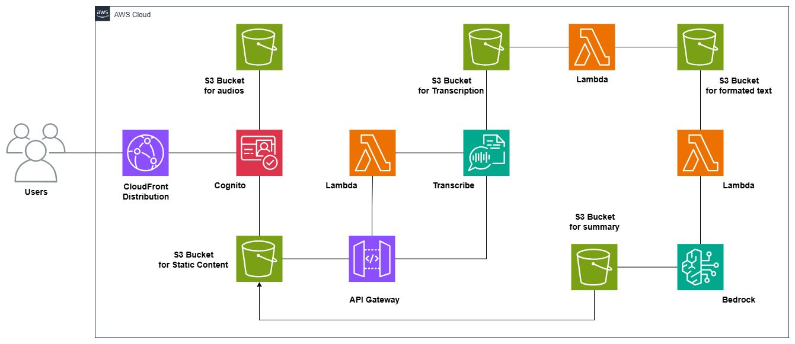

# Transcripción con Resumen - Backend (Spanish version)

[English](#english) | [Español](#español)

## Español

Este proyecto implementa un backend serverless en AWS para un sistema de transcripción y resumen de audio utilizando AWS CDK con Python.

A diferencia de otros servicios de transcripción y resúmenes, esta aplicación está enfocada en la privacidad de la información de forma que el usuario final tenga control sobre los audios que sube a la plataforma, con la seguridad que no van a ser usados por terceros y con la posibilidad de eliminarlos en cualquier momento.

<p align="center">
  <em>Arquitectura de servicios en AWS</em>
  
</p>

## Descripción del Proyecto

El sistema está compuesto por dos funciones Lambda principales:

- **Lambda Transcribir** (`lambda/transcribir/lambda_function.py`): Se encarga de procesar archivos de audio y convertirlos en texto utilizando servicios de transcripción de AWS.
- **Lambda Formatear** (`lambda/formatear/lambda_function.py`): Procesa el texto transcrito para generar resúmenes y dar formato al contenido.

## Arquitectura

El proyecto utiliza:
- **AWS CDK (Cloud Development Kit)** para la infraestructura como código
- **AWS Lambda** para el procesamiento serverless
- **Python** como lenguaje de programación principal

La infraestructura se define en `transcripcion_con_resumen_backend_stack.py` utilizando CDK.

## Configuración del Entorno

### Prerrequisitos
- Python 3.x
- AWS CLI configurado
- AWS CDK instalado

### Instalación

1. Clona el repositorio y navega al directorio del proyecto:
```bash
cd transcripcion-con-resumen-backend
```

2. Crea y activa el entorno virtual:
```bash
python -m venv .venv
source .venv/bin/activate  # En Windows: .venv\Scripts\activate.bat
```

3. Instala las dependencias:
```bash
pip install -r requirements.txt
```

## Despliegue

1. Sintetiza la plantilla de CloudFormation:
```bash
cdk synth
```

2. Despliega la infraestructura:
```bash
cdk deploy
```

## Estructura del Proyecto

```
transcripcion-con-resumen-backend/
├── lambda/
│   ├── transcribir/
│   │   └── lambda_function.py    # Función para transcripción de audio
│   └── formatear/
│       └── lambda_function.py    # Función para formateo y resumen
├── transcripcion_con_resumen_backend/
│   └── transcripcion_con_resumen_backend_stack.py  # Definición de infraestructura CDK
└── README.md
```

## Comandos Útiles

* `cdk ls`          lista todos los stacks en la aplicación
* `cdk synth`       emite la plantilla de CloudFormation sintetizada
* `cdk deploy`      despliega este stack en tu cuenta/región de AWS por defecto
* `cdk diff`        compara el stack desplegado con el estado actual
* `cdk docs`        abre la documentación de CDK

---

## English

# Transcription with Summary - Backend (Englis version)

This project implements a serverless backend on AWS for an audio transcription and summarization system using AWS CDK with Python.

Unlike other transcription and summarization services, this application is focused on information privacy, ensuring that the end user maintains full control over the audio files they upload to the platform, with the guarantee that they will not be used by third parties and can be deleted at any time.

<p align="center">
  <em>AWS Services Architecture</em>
  
</p>

## Project Description

The system consists of two main Lambda functions:

- **Transcribe Lambda** (`lambda/transcribir/lambda_function.py`): Handles audio file processing and converts them to text using AWS transcription services.
- **Format Lambda** (`lambda/formatear/lambda_function.py`): Processes the transcribed text to generate summaries and format the content.

## Architecture

The project utilizes:
- **AWS CDK (Cloud Development Kit)** for infrastructure as code
- **AWS Lambda** for serverless processing
- **Python** as the main programming language

The infrastructure is defined in `transcripcion_con_resumen_backend_stack.py` using CDK.

## Environment Setup

### Prerequisites
- Python 3.x
- AWS CLI configured
- AWS CDK installed

### Installation

1. Clone the repository and navigate to the project directory:
```bash
cd transcripcion-con-resumen-backend
```

2. Create and activate the virtual environment:
```bash
python -m venv .venv
source .venv/bin/activate  # On Windows: .venv\Scripts\activate.bat
```

3. Install dependencies:
```bash
pip install -r requirements.txt
```

## Deployment

1. Synthesize the CloudFormation template:
```bash
cdk synth
```

2. Deploy the infrastructure:
```bash
cdk deploy
```

## Project Structure

```
transcripcion-con-resumen-backend/
├── lambda/
│   ├── transcribir/
│   │   └── lambda_function.py    # Function for audio transcription
│   └── formatear/
│       └── lambda_function.py    # Function for formatting and summarization
├── transcripcion_con_resumen_backend/
│   └── transcripcion_con_resumen_backend_stack.py  # CDK infrastructure definition
└── README.md
```

## Useful Commands

* `cdk ls`          list all stacks in the app
* `cdk synth`       emits the synthesized CloudFormation template
* `cdk deploy`      deploy this stack to your default AWS account/region
* `cdk diff`        compare deployed stack with current state
* `cdk docs`        open CDK documentation